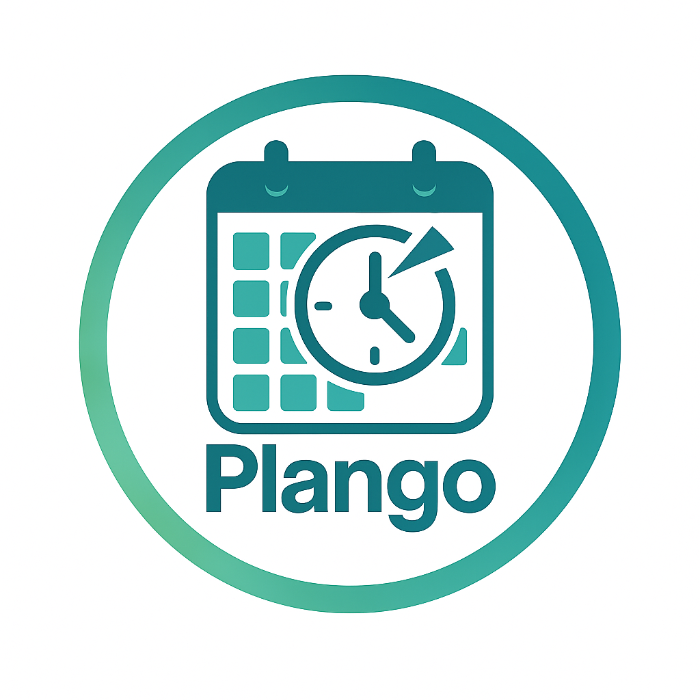

# Plango Calendar Mobile App

**Plango** is an advanced calendar and scheduling app designed specifically for businesses and service providers. It offers an intuitive and efficient scheduling experience, with features tailored for team coordination, appointments, service bookings, and much more. 

### Currently in Development 🚧

Plango is actively being developed. Currently, the app is in early stages of development, and while it is functional for basic scheduling needs, As a solo developer, I'm continuously enhancing and expanding its functionality to deliver a robust and advanced scheduling solution for businesses and service providers.



## Features (Planned for Final Release) 🚀

### 🗓️ **Advanced Scheduling**
- **Recurring Events**: Schedule events that repeat on a daily, weekly, or monthly basis, with customizable frequency.
- **Conflict Detection**: Automatically detect and resolve scheduling conflicts with intuitive suggestions.

### 🧑‍🤝‍🧑 **Team Scheduling & Collaboration**
- **Team Calendars**: Share calendars with teams and clients, view multiple team members’ availability, and schedule events efficiently.
- **Team Roles & Permissions**: Assign and manage roles and permissions for team members, allowing admins to control who can edit or view specific events.
- **Real-Time Updates**: Get real-time updates and notifications when team members add or modify events.

### 🔔 **Customizable Reminders**
- **Automated Reminders**: Set automatic reminders for upcoming events, meetings, or deadlines, with customizable time intervals (e.g., 15 minutes, 1 hour).
- **Push Notifications**: Receive push notifications on your mobile device to ensure you never miss an important event.

### 📅 **Smart Scheduling**
- **Optimized Scheduling**: Automatically suggest the best meeting times based on participant availability.
- **Availability Tracking**: Track and display available time slots for all team members, making it easy to find common availability.
- **External Calendar Integration**: Sync with Google Calendar, Outlook, and other external calendars for easy import and export of events.

### 🧩 **Event & Task Management**
- **Event Types**: Support for different event types (e.g., appointments, team meetings, webinars) with customizable properties.
- **Task Assignments**: Assign tasks within events, and track completion status to ensure follow-ups.
- **Notes and Attachments**: Attach files, notes, and documents to events for better organization.

### 📊 **Analytics & Reporting**
- **Event Analytics**: Track event attendance, durations, and frequencies over time to analyze trends.
- **Team Performance**: Generate reports on team performance, meeting participation, and time allocation.

### 🛠️ **Business & Service Provider Tools**
- **Appointment Booking**: Allow clients to book appointments directly from your calendar, with automatic confirmations and reminders.
- **Service Management**: Create, schedule, and manage recurring services for customers, with the ability to set up custom pricing and durations.

### 🧑‍💻 **API & Integrations**
- **Open API**: Access and manage your calendar data programmatically with a REST API, allowing for further integrations and customizations.
- **Third-Party Integrations**: Seamlessly integrate with CRM systems, task management tools, and communication platforms.

### 🔒 **Security & Privacy**
- **End-to-End Encryption**: Ensure the highest level of security with end-to-end encryption for all your data.
- **Data Backup**: Automatically back up event and calendar data to ensure nothing is lost.
- **Role-Based Access Control**: Fine-grained access control based on user roles to protect sensitive information.

## Installation Instructions

### Prerequisites
- Android Studio 4.0+ (for development and testing)
- JDK 8+ (Java Development Kit)
- A physical Android device or emulator for testing

### Clone the Repository
1. Clone the repository:
   ```bash
   git clone https://github.com/your-username/plango-calendar.git
